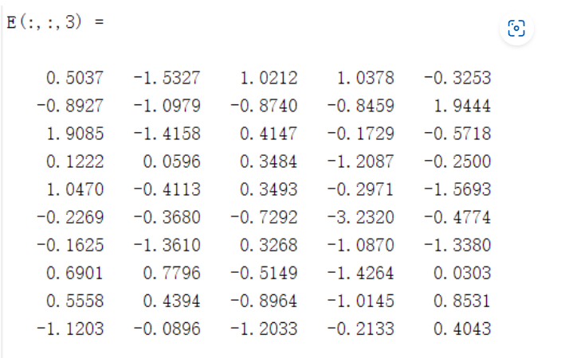

#Matlab入门
##一.变量命名

###1）注释
%% 独占一行的注释（有上下横线分割）

% 普通注释

###2）清空环境变量及命令
clear all 清除Workspace中的所有变量（右侧工作区）

clc 清除Command Window中的所有命令（命令行窗口）

###3）变量命名规则

①变量名区分大小写

②变量名长度不超过63位（hhh，不会有人把变量名弄这么长吧~）

③变量名简洁明了，尽量做到见名知意

##一.数据类型
###1）数字

2 + 4

10-7

3*5

8/2

###2）字符与字符串

s = ‘a’ （单引号表示字符串）

==abs(s)==ASCII码

char(97) 输出 a （ASCII码转字符串）

num2str(65) 输出数字65

str=‘I love MATLAB & Machine Learning’

length(str) 字符串长度

doc num2str

###3）矩阵（Matlab最NB的东西）

A = [1 2 3; 4 5 2; 3 2 7]

B = A’ 把A进行转置，行变列，列变行

D = inv(A) 逆矩阵（必须时方阵才能求逆矩阵）

执行下面两条语句
D = inv(A) （求逆矩阵）
A * D （相当于A×A的逆）

E = zeros(10,5,3) 创建一个10行5列3维的全0矩阵

E(:,:,1) = rand(10,5)

rand生成均匀分布的伪随机数。分布在（0~1）之间

主要语法：rand(m,n)生成m行n列的均匀分布的伪随机数

rand(m,n,‘double’)生成指定精度的均匀分布的伪随机数，参数还可以是’single’

rand(RandStream,m,n)利用指定的RandStream（随机种子）生成伪随机数

E(:,:,2) = randi(5,10,5)

randi生成均匀分布的伪随机数

主要语法：randi(iMax)在开区间(0,iMax)生成均匀分布的伪随机数

randi(iMax,m,n)在开区间(0,iMax)生成mXn型随机矩阵

r = randi([iMin,iMax],m,n)在开区间(iMin，iMax)生成mXn型随机矩阵

E(:,:,3) = randn(10,5)

randn生成标准正态分布的伪随机数（均值为0，方差为1）

##4.元胞数组和结构体
元胞数组：是MATLAB中特有的一种数据类型，是数组的一种，其内部元素可以是属于不同的布局类型，概念理解上，可以认为它和C语言里面的结构体、C++里面的对象很类似。元胞数组是MATLAB中的特色数据类型，它不同于其它数据类型（如字符型，字符数组或者字符串，以及一般的算数数据和数组）。它特有的存取数据方法决定了它的特点，它有给人一种查询信息的感觉，可以逐渐追踪一直到所有的变量全部翻译成基本数据信息。它的class函数输出就是cell（细胞）

%元胞数组
A = cell(1,6)
A{2} = eye(3) %2021版本前的matlab下标从1开始
A{5} = magic(5)
B = A{5}
注：magic：字面意思是魔方，魔术的意思。在MATLAB中用来生成n阶幻方。比如三阶幻方就是1-9九个数字，组成一个3*3的矩阵，使得该矩阵无论横、竖还是斜三个方向上的三个数的和总是相同的。幻方是一个很古老的问题，试一下就知道了！

结构体
%结构体
books = struct('name',{{'Machine Learning','Data Mining'}},'price',[30,40])
books.name %属性
books.name(1)
books.name{1}
##矩阵操作
###1）矩阵的定义与构造

###2）矩阵的四则运算

###3）矩阵的下标
A = magic(5)
B = A(2,3)
C = A(3,:) % :为取全部,那么这条语句表示取第三行
D = A(:,4) %取第四列
[m,n] = find(A > 20) %找到大于20的序号值/矩阵
%取的是索引值

